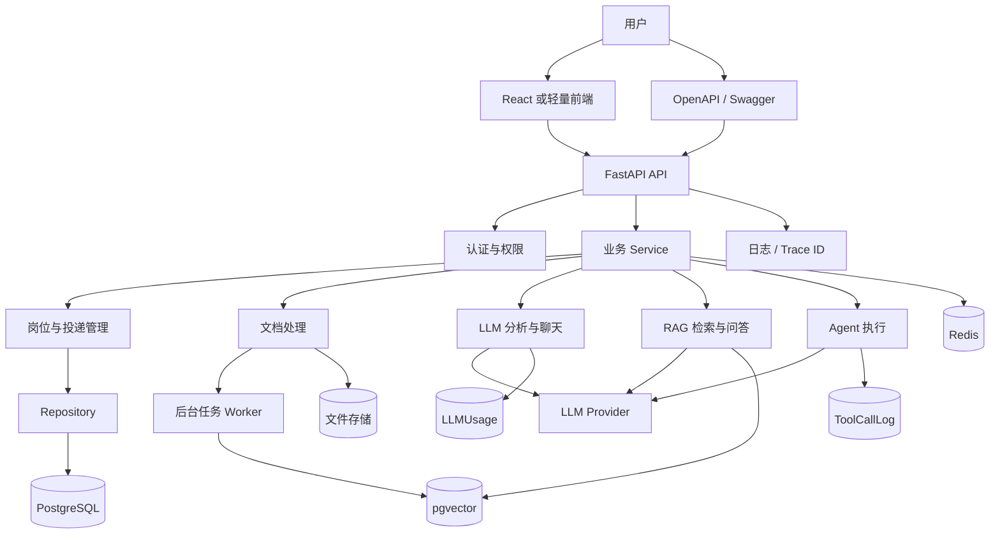
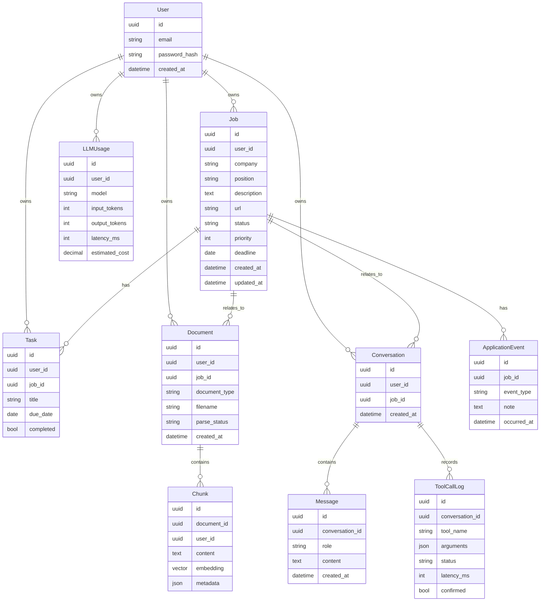
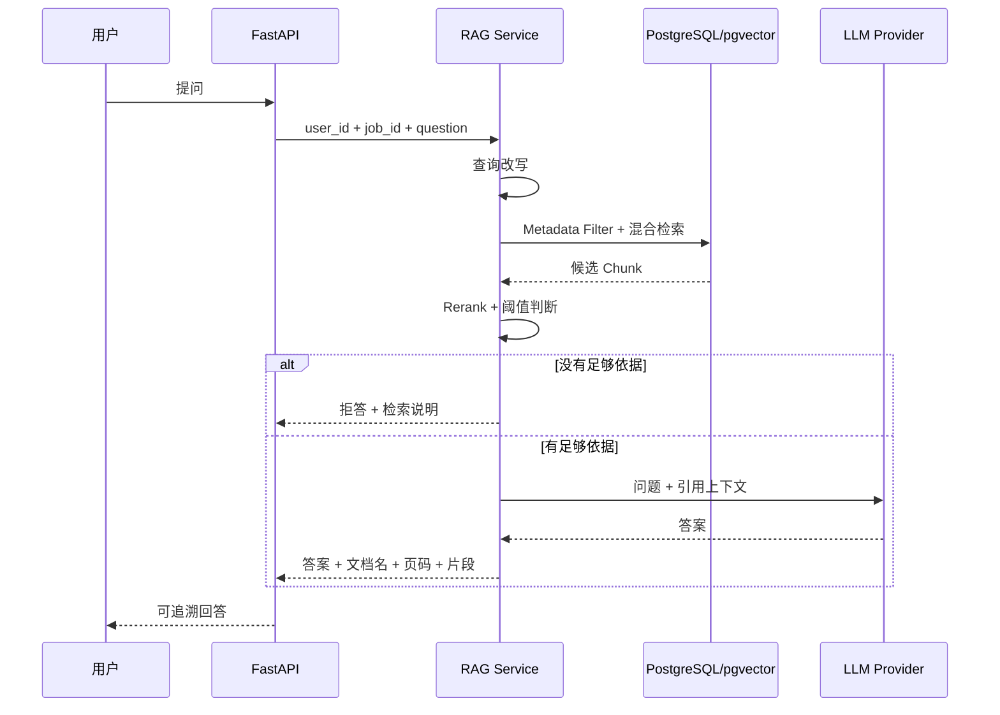
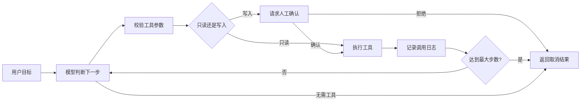

# AI Job Copilot 完整学习与项目架构指南
本文集说明了详细知识、架构、学习方法和面试参考

## 1. 文档目的

这份文档用于指导当前 Job Tracker 从一个 Python 命令行练习项目，持续演进为可部署、可演示、可评测，并适合写入简历的 **AI 求职助手**。

本文件是长期学习教材和架构参考，不记录每日进度、完成状态或下一次任务。当前状态以 [CURRENT_PROGRESS.md](CURRENT_PROGRESS.md) 为准，阶段顺序以 [PROJECT_ROADMAP.md](PROJECT_ROADMAP.md) 为准。

项目的首要目的不是堆叠技术名词，而是通过一条连续的业务主线学习并证明以下能力：

- Python 工程基础
- FastAPI 后端开发
- PostgreSQL 数据建模与用户权限隔离
- LLM API 应用开发
- 带引用的 RAG
- 有安全边界的 Agent
- 测试、评测、日志、Docker、CI/CD 和部署

目标岗位：

- AI 大模型应用开发工程师
- AI 应用后端工程师
- RAG 应用开发工程师
- Agent 应用开发工程师
- Python 后端 AI 方向

配套文档：

- [CURRENT_PROGRESS.md](CURRENT_PROGRESS.md)：当前进度和下一次任务
- [PROJECT_ROADMAP.md](PROJECT_ROADMAP.md)：里程碑顺序和退出条件
- 本文档：详细知识、系统架构、学习方法和面试参考

## 2. 最终项目定位

### 2.1 项目名称

**AI Job Copilot - 基于 RAG 与 Agent 的智能求职管理平台**

### 2.2 一句话介绍

面向求职者的 AI 应用平台，支持岗位与投递进度管理、JD 结构化分析、简历匹配、基于个人资料的 RAG 问答，以及带人工确认机制的求职规划 Agent。

### 2.3 要解决的真实问题

求职者通常需要同时管理：

- 大量岗位链接与完整 JD
- 不同公司的投递状态
- 笔试、面试、Offer 等时间线
- 多个简历版本
- 面试准备资料和待办任务
- 不同岗位的技能要求和准备重点

这些信息分散在招聘网站、表格、聊天记录和本地文件中。AI Job Copilot 需要把它们统一管理，并利用 LLM、RAG 和 Agent 降低信息整理和决策成本。

### 2.4 核心用户价值

用户应该能够完成以下任务：

1. 保存岗位并追踪投递进度。
2. 上传简历、JD 和面试资料。
3. 自动从 JD 提取技能、经验、学历、职责和加分项。
4. 对比 JD 与个人资料，生成匹配项、差距和准备清单。
5. 基于个人资料和岗位资料提问，并获得带原文引用的回答。
6. 查询本周需要跟进的岗位、逾期任务和面试安排。
7. 让 Agent 生成行动计划和求职周报。
8. Agent 修改任务或岗位状态前必须获得人工确认。

### 2.5 非目标

项目早期不追求：

- 训练基础大模型
- 从零训练 Embedding 模型
- 复杂多 Agent 协作
- Kubernetes 和微服务拆分
- 多模态 OCR 全覆盖
- 精致但耗时很长的前端
- 没有评测依据的复杂模型路由

先完成一条可靠、可测、可解释的业务链路，再增加高级功能。

## 3. 项目演进主线

项目从 M1 Python CLI 起步，基础版本需要包含：

- `Job` dataclass 和 `JobStatus` enum
- UUID 业务 ID
- 岗位 CRUD、筛选、搜索和重复检测
- JSON 持久化与临时文件安全写入
- Model、Repository、Service、CLI 分层
- 自定义异常和依赖注入

后续演进路线：

```text
Python CLI Job Tracker
        ↓
pytest + Ruff + mypy
        ↓
FastAPI + PostgreSQL + JWT
        ↓
LLM JD 分析与简历匹配
        ↓
个人求职资料 RAG
        ↓
混合检索、重排和离线评测
        ↓
手写 Agent Loop
        ↓
LangGraph + Human-in-the-loop
        ↓
Docker + CI/CD + 在线部署
```

核心原则：每个阶段都在同一个项目上增加能力，不另外创建互不相关的聊天机器人、文件系统或知识库 Demo。

## 4. 目标岗位能力地图

| 能力领域 | 需要掌握 | 项目中的证明 |
| --- | --- | --- |
| Python | 类型系统、异常、OOP、异步、上下文管理器 | 分层代码、类型注解、自定义异常、异步任务 |
| 软件设计 | 单一职责、依赖注入、Repository、Provider | CLI/API 复用 Service，存储和模型可替换 |
| API | REST、状态码、分页、认证、文件上传、SSE | FastAPI OpenAPI 和完整接口测试 |
| 数据库 | 表设计、关系、索引、事务、迁移 | PostgreSQL、SQLAlchemy 2、Alembic |
| LLM | Prompt、Token、上下文、结构化输出、重试 | JD 提取、匹配分析、多轮聊天 |
| RAG | 解析、切块、Embedding、检索、重排、引用 | 个人知识库和离线评测结果 |
| Agent | Tool Calling、状态、路由、确认、执行限制 | 求职计划 Agent 和工具审计日志 |
| 工程化 | 日志、缓存、后台任务、Docker、CI/CD | 可部署环境和自动化流水线 |
| 质量 | 单元测试、接口测试、评测集、性能指标 | pytest、覆盖率、RAG 指标和 P95 延迟 |
| 安全 | 身份认证、用户隔离、文件限制、Prompt Injection | 所有数据强制带 `user_id`，写操作人工确认 |

## 5. 最终系统总体架构



### 5.1 各层职责

#### 交互层

- CLI：第一阶段学习和调试入口
- FastAPI：正式后端入口
- 前端：最终演示入口

交互层只负责接收输入、调用 Service、转换响应，不直接编写 SQL、读写 JSON 或调用模型。

#### Service 层

负责业务规则：

- 重复岗位判断
- 状态流转
- 用户权限校验
- JD 分析流程
- 文档处理流程
- RAG 问答流程
- Agent 工具调度

#### Repository 层

负责数据访问：

- JSON 文件读写
- PostgreSQL 增删改查
- 用户数据过滤
- 事务和并发控制

#### Provider 层

负责外部能力：

- LLM 调用
- Embedding 调用
- Reranker 调用
- 文件存储

Service 依赖接口，不直接绑定某一个模型厂商。

## 6. 推荐项目目录

最终目录可以逐步演进为：

```text
app/
├── api/
│   ├── dependencies.py
│   ├── error_handlers.py
│   └── routes/
├── agent/
│   ├── graph.py
│   ├── state.py
│   ├── tools.py
│   └── policies.py
├── core/
│   ├── config.py
│   ├── logging.py
│   └── security.py
├── db/
│   ├── base.py
│   ├── session.py
│   └── migrations/
├── models/
│   ├── domain/
│   └── orm/
├── providers/
│   ├── llm/
│   ├── embedding/
│   └── reranker/
├── rag/
│   ├── parser.py
│   ├── cleaner.py
│   ├── chunker.py
│   ├── indexer.py
│   ├── retriever.py
│   └── evaluator.py
├── repositories/
├── schemas/
├── services/
├── workers/
└── main.py
tests/
├── unit/
├── integration/
├── api/
├── rag/
└── agent/
```

不要在项目早期一次性创建全部空目录。只有开始实现对应模块时再创建。

## 7. 核心数据模型



所有属于用户的数据必须包含 `user_id`。任何查询都不能先取出全部数据再在 Python 中过滤，而应该在 Repository 查询条件中强制包含当前用户。

## 8. 三条关键业务链路

### 8.1 JD 分析链路

```text
用户保存岗位 JD
→ Service 构造分析请求
→ LLMProvider 调用模型
→ 模型返回结构化 JSON
→ Pydantic 校验
→ 校验成功后写入数据库
→ 返回技能、经验、职责和加分项
```

关键要求：

- 模型输出不能未经校验直接入库。
- 超时、限流和临时错误可以有限重试。
- 重试次数必须有上限。
- 记录 Token、延迟、模型和估算成本。
- 非法输出不能污染原始岗位数据。

### 8.2 RAG 问答链路



关键要求：

- 检索必须带 `user_id`。
- 回答必须返回引用。
- 没有依据时明确拒答。
- 删除或修改文档后不能检索到旧内容。
- 检索效果通过评测集验证，而不是凭感觉判断。

### 8.3 Agent 执行链路



关键要求：

- 工具参数使用 Pydantic 校验。
- 只读工具与写工具明确分级。
- 写操作必须人工确认。
- 有最大步骤、总超时和单工具超时。
- 每次调用记录工具名、参数摘要、耗时、结果和错误。
- 文档中的 Prompt Injection 不能修改系统权限规则。

## 9. 分阶段学习路线

日期用于控制节奏，真正进入下一阶段的条件是完成验收标准。

### M1：可靠的 Python CLI

#### 阶段目标

完成一个退出后数据不丢失、错误输入不会崩溃、代码职责清楚的命令行应用。

#### 需要掌握

- Python 函数、类、列表、字典和循环
- `dataclass`、`Enum`、UUID、`datetime`
- 类型注解和 `Protocol`
- 自定义异常与异常链
- `pathlib.Path`
- JSON 序列化和反序列化
- 上下文管理器 `with`
- Repository Pattern
- 依赖注入
- pytest、fixture、`tmp_path`
- asyncio 基本概念

#### 实践内容

- `Job` dataclass 和 `JobStatus`
- Model、Repository、Service、CLI 分层
- 添加、查看、修改、删除、筛选和搜索
- 重复岗位检测
- JSON 永久保存和临时文件安全写入
- 自定义异常和友好错误
- Model、Service 和 JSON Repository 单元测试
- Ruff、mypy、pytest 和 coverage
- 独立 asyncio 获取多个 JD 的小练习
- README 测试方法和终端演示

#### 验收标准

- `python -m app.main` 能完成全部功能。
- 文件不存在时正常启动。
- JSON 损坏时显示友好错误，不覆盖损坏文件。
- 测试不操作真实 `data/jobs.json`。
- 核心代码覆盖率达到约 80%。
- `ruff check .`、`mypy app`、`pytest` 通过。

#### 面试时要能解释

- 为什么 Service 不直接读写 JSON？
- 为什么 CLI 不保存全局岗位列表？
- 为什么用 UUID 而不是列表下标？
- `Job -> dict -> JSON` 如何转换和恢复？
- 临时文件加 `os.replace()` 解决什么问题？
- 依赖注入如何方便未来替换 PostgreSQL？

### M2：FastAPI 与 PostgreSQL 后端

#### 阶段目标

把 CLI 的核心业务迁移到多用户 Web API，同时保留 Service 和 Repository 分层。

#### 需要掌握

- HTTP 方法、状态码、Header、Cookie
- REST 资源设计
- FastAPI 路由和依赖注入
- Pydantic v2 请求与响应模型
- SQLAlchemy 2 ORM
- PostgreSQL 表、外键、索引和事务
- Alembic 数据库迁移
- 密码哈希和 JWT
- 分页、排序和筛选
- 文件上传限制
- httpx 和接口测试

#### 推荐实现顺序

1. 创建 `/health`。
2. 使用 Pydantic 定义岗位请求和响应。
3. 先建立岗位 CRUD API。
4. 引入 PostgreSQL Repository。
5. 使用 Alembic 管理表结构。
6. 添加注册、登录和 JWT。
7. 所有岗位查询增加 `user_id`。
8. 添加投递时间线和待办任务。
9. 添加文件上传和元数据记录。
10. 编写正常、错误、未认证和越权测试。

#### 最小 API

```text
POST   /auth/register
POST   /auth/login
GET    /jobs
POST   /jobs
GET    /jobs/{job_id}
PATCH  /jobs/{job_id}
DELETE /jobs/{job_id}
GET    /jobs/{job_id}/events
POST   /jobs/{job_id}/events
GET    /tasks
POST   /tasks
POST   /documents
GET    /documents
DELETE /documents/{document_id}
```

#### 验收标准

- 用户只能访问自己的岗位、任务和文件。
- 列表接口支持分页、排序和组合筛选。
- 越权访问返回明确状态码，不泄露资源是否存在。
- 数据库变更全部通过 Alembic。
- OpenAPI 可以走完注册、登录、创建岗位、上传文件流程。
- API 核心路径有自动测试。

#### 面试时要能解释

- Pydantic Schema 和 ORM Model 为什么分开？
- JWT 如何签发、校验和过期？
- 为什么密码不能明文保存？
- 什么是数据库事务？
- `user_id` 应该在哪一层强制过滤？
- 如何防止用户通过修改 ID 访问别人的岗位？

### M3：LLM 岗位分析与多轮聊天

#### 阶段目标

不做普通聊天 Demo，而是让 LLM 直接解决 JD 提取、匹配分析和面试准备问题。

#### 需要掌握

- Token 和 Context Window
- System Prompt、User Prompt、Few-shot
- Temperature 和确定性
- Structured Output
- Pydantic 输出校验
- Function Calling / Tool Calling
- SSE 流式输出
- 多轮对话上下文管理
- 超时、重试、限流和并发控制
- Token 使用量和成本估算

#### 核心功能

- 从 JD 提取技能、经验、职责、学历和加分项。
- 对比 JD 与用户技能档案。
- 返回匹配项、技能差距和准备清单。
- 针对一个岗位进行多轮对话。
- 使用 SSE 返回流式响应。
- 查询岗位详情和投递状态的简单工具。

#### Provider 接口

业务层不直接调用某个厂商 SDK，先定义统一接口：

```python
class LLMProvider(Protocol):
    async def generate(self, request: LLMRequest) -> LLMResponse:
        ...

    async def stream(self, request: LLMRequest):
        ...
```

需要统一处理：

- 模型名称
- 超时
- 重试
- Token 统计
- 错误转换
- 并发限制

#### 验收标准

- 结构化结果必须经过 Pydantic 校验后才能入库。
- 非法输出不会覆盖旧数据。
- 超时、限流和模型异常有用户可理解的提示。
- 流式连接中断不会产生半条已完成消息。
- 保存输入/输出 Token、延迟和模型名称。
- 同一业务代码可以切换模型配置。

#### 面试时要能解释

- Structured Output 为什么仍需要本地校验？
- Temperature 如何影响 JD 提取？
- 多轮对话为什么需要截断或摘要？
- SSE 和普通 JSON 响应有什么区别？
- 哪些错误应该重试，哪些不应该？
- 如何控制模型成本？

### M4：RAG 基础版

#### 阶段目标

建立可追溯的个人求职知识库，回答必须基于用户自己的资料并返回引用。

#### 需要掌握

- PDF、Word、TXT 解析
- 文本清洗
- 固定长度和语义切块
- Chunk size 与 overlap
- Embedding
- Cosine Similarity
- Top-k
- pgvector
- Metadata Filter
- 引用和拒答

#### 推荐实现顺序

1. 首先只支持 PDF。
2. 保存原始文档元数据。
3. 解析文本并保留页码。
4. 清洗空白、页眉和重复内容。
5. 切块并保存 chunk index。
6. 批量生成 Embedding。
7. 写入 pgvector。
8. 使用 `user_id`、文档类型和岗位 ID 检索。
9. 构造带引用上下文的回答。
10. 删除文档时同步删除 Chunk。

#### 验收标准

- 每个答案返回文档名、页码或段落、原文片段。
- 不同用户之间无法相互检索。
- 没有相关片段时不强行回答。
- 文档删除后不能检索到旧 Chunk。
- 解析、切块和检索分别有测试。
- 建立至少 20 个手工问题的初始评测集。

#### 面试时要能解释

- 为什么选择 RAG 而不是微调？
- Chunk 太大或太小分别有什么问题？
- overlap 有什么作用和成本？
- Top-k 越大是否一定越好？
- Metadata Filter 为什么必须在检索阶段执行？
- 引用如何定位到原文？

### M5：RAG 优化与评测

#### 阶段目标

把“感觉回答不错”变成有数据支持的检索与生成系统。

#### 需要掌握

- Query Rewrite
- PostgreSQL 全文检索
- BM25 概念
- Hybrid Search
- Reciprocal Rank Fusion
- Reranker
- 相关性阈值
- 无答案拒答
- RAG 离线评测
- 延迟和成本分析

#### 实验变量

- chunk size
- chunk overlap
- vector top-k
- keyword top-k
- rerank top-n
- 相似度阈值
- 是否 Query Rewrite
- 是否使用 Reranker

每次实验要保存配置和结果，避免只保留最终数字。

#### 核心指标

| 指标 | 说明 |
| --- | --- |
| Recall@3 / Recall@5 | 正确依据是否出现在前 3/5 个结果 |
| 答案正确率 | 最终回答是否正确 |
| 引用正确率 | 引用是否真正支持答案 |
| 拒答正确率 | 无依据问题是否正确拒答 |
| P50 / P95 延迟 | 一般和慢请求耗时 |
| Token 消耗 | 每次问答的模型成本 |

#### 验收标准

- README 有基线与优化后的对比表。
- 每项优化能说明收益和代价。
- 知识库外问题能够稳定拒答。
- 检索、生成、引用三个环节可以分别定位问题。

#### 面试时要能解释

- 向量检索和关键词检索各自擅长什么？
- Hybrid Search 如何融合两类结果？
- Reranker 为什么放在初次召回之后？
- 如何判断问题出在检索还是生成？
- 为什么 P95 比平均响应时间更重要？

### M6：手写 Agent Loop

#### 阶段目标

不使用复杂框架，先理解 Agent 的最小执行循环和安全边界。

#### 需要掌握

- Function Calling
- ReAct 基本思想
- Agent State
- Tool Schema
- Tool Routing
- 最大执行步数
- 单工具超时
- 重试和幂等
- Human-in-the-loop
- 工具审计

#### 第一批工具

只读工具：

- `search_knowledge_base`
- `get_job`
- `list_jobs`
- `list_application_events`
- `list_tasks`
- `list_overdue_tasks`
- `get_weekly_funnel`

写工具：

- `create_task`
- `update_task`
- `update_job_status`

写工具执行前必须生成确认信息，展示：

- 将执行的操作
- 目标资源
- 关键参数
- 可能影响

#### 验收标准

- Agent 不会无限调用工具。
- 无效参数不会进入 Service。
- 工具超时后能够安全终止。
- 写操作没有确认时绝不执行。
- 每次调用都有日志。
- 文档中的恶意指令不能调用越权工具。

#### 面试时要能解释

- Agent 和普通 Function Calling 有什么区别？
- 为什么 Agent 必须有最大步数？
- 为什么读取和写入工具要分级？
- 人工确认应该放在模型前还是工具执行前？
- 如何防止工具被重复执行？

### M7：LangGraph Agent

#### 阶段目标

把已理解的手写循环重构为可恢复、可观测、可测试的状态图。

#### 需要掌握

- Graph、Node、Edge
- 条件路由
- State Schema
- Checkpoint
- 中断与恢复
- Memory
- Human-in-the-loop
- 节点级测试

#### 推荐节点

```text
load_context
→ planner/router
→ validate_tool
→ execute_read_tool
→ request_approval
→ execute_write_tool
→ observe
→ answer
```

#### 典型演示任务

- 列出本周需要跟进的岗位并生成行动计划。
- 根据目标岗位和个人资料生成面试清单。
- 分析本周投递漏斗并生成周报。
- 为逾期任务调整日期，确认后写入数据库。

#### 验收标准

- 支持用户拒绝确认。
- 支持工具失败和参数错误。
- 支持执行中断和恢复。
- 所有状态转换有 Trace ID。
- 针对死循环、工具失败和拒绝确认编写测试。

### M8：前端、部署与工程化

#### 阶段目标

把代码仓库变成招聘者能够实际运行和体验的作品。

#### 需要掌握

- Docker 和 Docker Compose
- Redis
- 后台任务
- 结构化日志
- Trace ID
- 限流
- 缓存
- 环境变量
- GitHub Actions
- Linux 部署

#### 最小前端页面

- 登录和注册
- 岗位看板
- 岗位详情和状态时间线
- 文档上传与解析状态
- RAG 聊天
- Agent 确认框
- 投递统计

前端以清晰演示业务链路为目标，不优先追求复杂动画和视觉效果。

#### 验收标准

- `docker compose up` 能启动必要服务。
- 新环境按 README 能完成安装。
- CI 自动执行 lint、type check、test 和构建。
- 有健康检查、日志、Trace ID 和错误提示。
- 密钥不进入 Git。
- 有在线演示、样例账号和脱敏样例数据。

### M9：面试与简历交付

#### 阶段目标

把“做过项目”转化为“能够清晰证明能力”。

#### 项目介绍四个版本

- 30 秒：问题、解决方案和最强亮点。
- 2 分钟：业务流程、技术栈和结果。
- 5 分钟：架构、RAG、Agent 安全和评测。
- 深挖版：索引、事务、缓存、并发、幂等、成本和局限。

#### 必须准备的面试主题

- Transformer、Attention、Token、Embedding
- RAG 与微调的区别
- Chunk、Top-k、Hybrid Search、Reranker
- 幻觉、引用和拒答
- Prompt Injection 和用户隔离
- SSE、异步 I/O 和后台任务
- JWT、索引、事务和缓存
- Agent 最大步数、确认和审计
- Docker、CI/CD 和部署

## 10. 测试策略

```text
少量端到端测试
      ↑
接口与集成测试
      ↑
大量单元测试
```

### 单元测试

- Model 校验
- Service 业务规则
- Chunker
- Query Rewrite
- Tool 参数校验
- Agent 路由判断

### 集成测试

- PostgreSQL Repository
- pgvector 检索
- Redis 缓存
- 文档解析流水线
- Agent 工具调用

### API 测试

每个关键接口至少覆盖：

- 正常请求
- 参数错误
- 未认证
- 越权访问
- 资源不存在
- 下游服务失败

### LLM 测试

单元测试不应依赖真实模型稳定输出。使用 Fake Provider 或 Mock 固定响应，另外保留少量真实模型集成测试。

### RAG 测试

RAG 需要同时测试：

- 解析是否正确
- Chunk 是否保留来源
- 检索是否命中依据
- 回答是否引用正确
- 无依据时是否拒答

## 11. 安全与隐私

### 用户隔离

- 所有用户数据带 `user_id`。
- Repository 查询强制加入当前用户。
- 文件和向量同样隔离。
- 越权响应不泄露资源是否存在。

### 文件安全

- 限制文件类型和大小。
- 不相信客户端 MIME Type。
- 文件名不直接作为磁盘路径。
- 解析任务设置超时。
- 删除文档时同步清理 Chunk 和向量。

### 密钥安全

- API Key 只通过环境变量注入。
- `.env` 不提交 Git。
- 日志不记录 Token、密码和完整简历。

### Agent 安全

- 只读和写入工具分级。
- 写操作人工确认。
- 限制最大步骤和总耗时。
- 工具参数强类型校验。
- 记录审计日志。
- 文档内容不能改变系统权限。

## 12. 可观测性与成本

每次请求建议记录：

- Trace ID
- user_id（避免记录敏感详情）
- 请求类型
- 模型名称
- 输入/输出 Token
- 总延迟
- 检索延迟
- LLM 延迟
- 工具调用次数
- 重试次数
- 错误类型
- 估算成本

不要记录：

- 密码
- JWT
- API Key
- 完整简历
- 完整 Prompt 中的敏感资料

## 13. 每个功能的完成定义

一个功能只有同时满足以下条件才算完成：

- 有明确用户场景。
- 有清晰输入和输出。
- 有类型注解。
- 有数据校验。
- 有业务异常和友好提示。
- 有正常路径测试。
- 有关键异常路径测试。
- 有必要日志。
- 有 README 或 API 文档。
- formatter、lint、type check 和 test 通过。
- 能解释为什么这样设计。
- 能说出替代方案和当前局限。

## 14. 推荐学习方法

### 每个知识点使用四步法

1. **理解概念**：它解决什么问题？
2. **最小练习**：写一个脱离主项目的小例子。
3. **接入项目**：找到真实业务场景。
4. **复盘表达**：用自己的话解释设计、替代方案和局限。

例如学习依赖注入：

```text
理解：对象不自己创建依赖
→ 小练习：Service 接收 Repository
→ 项目：JobService(JsonJobRepository)
→ 复盘：方便替换 PostgreSQL 和测试 Fake Repository
```

### 每天的建议结构

- 30%：阅读概念和官方文档
- 50%：自己编码和调试
- 20%：测试、笔记和复述

不要连续复制整段代码。建议每完成一个方法就回答：

- 输入是什么？
- 输出是什么？
- 谁调用它？
- 它调用谁？
- 正常路径是什么？
- 失败路径是什么？
- 为什么放在这一层？

### 每周复盘

- 本周完成了哪些可运行功能？
- 哪些测试证明功能正确？
- 学到了哪些可以迁移到其他项目的知识？
- 哪些设计是临时方案？
- README 和架构图是否同步？
- 是否产生可以写进简历的可量化结果？

## 15. 优先级与范围控制

### P0：简历项目必须完成

- FastAPI + PostgreSQL + JWT
- 岗位、状态时间线和待办
- 文件上传
- JD 结构化分析
- 简历匹配分析
- 带引用和用户隔离的 RAG
- RAG 基线评测
- Agent 只读工具
- 写操作人工确认
- pytest、Docker、CI 和部署

### P1：明显增强竞争力

- Hybrid Search
- Reranker
- 拒答策略
- RAG 对比实验
- Redis
- 后台任务
- Trace ID
- 简洁前端

### P2：有时间再做

- 多模型路由
- OCR
- 多 Agent
- 消息队列
- 微调
- Kubernetes

如果进度落后，先删 P2，再减少 P1，不能牺牲 P0 的测试、用户隔离、引用和安全边界。

## 16. 最终求职交付物

项目完成后应具备：

- GitHub 仓库
- 清晰 README
- 在线演示地址
- OpenAPI 文档
- 架构图
- 数据模型图
- 项目截图
- 3-5 分钟演示视频
- Docker Compose
- CI 状态
- 测试和覆盖率说明
- RAG 评测数据
- 性能和成本数据
- 项目局限和后续优化
- 30 秒、2 分钟、5 分钟项目介绍

## 17. 简历描述模板

项目名称：

> AI Job Copilot - 基于 RAG 与 Agent 的智能求职管理平台

项目简介：

> 面向求职者的 AI 岗位管理与知识问答平台，支持岗位投递管理、JD 结构化解析、简历匹配分析、基于个人资料的 RAG 问答，以及具备人工确认机制的求职规划 Agent。

项目要点模板：

- 基于 FastAPI、SQLAlchemy 和 PostgreSQL 构建多用户求职管理后端，实现岗位、投递时间线、待办任务和文档管理。
- 设计统一 LLM Provider，支持 JD 结构化提取、简历匹配分析、流式多轮对话、超时重试和 Token 成本统计。
- 基于 pgvector 构建个人求职资料 RAG，实现文档解析、Metadata Filter、混合检索、重排、引用返回和无答案拒答。
- 使用 LangGraph 实现求职规划 Agent，支持岗位查询、逾期任务分析和周报生成，并对写操作增加人工确认、步骤上限和审计日志。
- 建立 RAG 离线评测集，记录检索命中率、引用正确率、拒答正确率、P95 延迟和 Token 消耗。
- 使用 pytest、Docker Compose 和 GitHub Actions 完成测试、容器化和持续集成。

注意：简历中的覆盖率、命中率、延迟和提升比例必须来自真实测试，不能提前编造。
